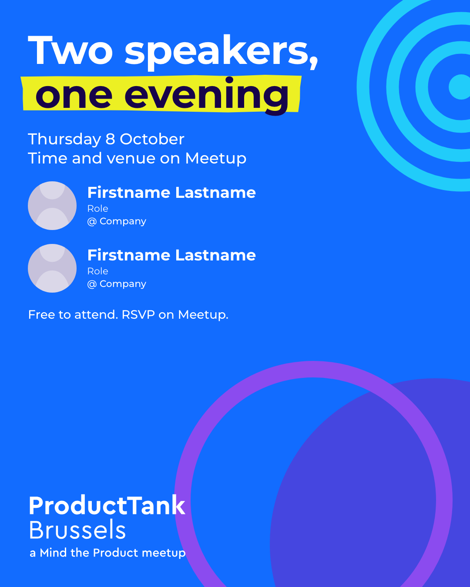

# ProductTank: a brand skill for ProductTank organisers

Make on-brand social posts and slide decks for a ProductTank meetup (a Mind the Product
meetup) from a chat instruction, and prove them on-brand with a machine gate before they go
out. Built for ProductTank Brussels, usable by any ProductTank once you drop in your city's
lockup.

It is a [Claude Code](https://claude.ai/code) skill: 20 social canvases (LinkedIn, Instagram,
Meetup, stories, covers, banners) and 9 slide layouts as standalone HTML, a design lock with
the brand's colours, type, spacing and rules, a 16-rule brand linter, a renderer that produces
PNG, PDF and PowerPoint, and a gauntlet that keeps all of it honest. The engine underneath is
[fidelity-machine](https://github.com/tudorjuravlea/fidelity-machine).



## What you need

- macOS or Linux, Node 20 or newer, git.
- Claude Code (the skill is a folder Claude Code reads), or any agent that can follow `SKILL.md`.
- For a city other than Brussels: your city's ProductTank lockup files from Mind the Product's
  ProductTank logo repository (ask your regional coordinator). Brussels ships ready.

## Install

Short sentences, one action per line.

1. Open a terminal.
2. Install the engine once:
   ```bash
   git clone https://github.com/tudorjuravlea/fidelity-machine ~/fidelity-machine && cd ~/fidelity-machine && npm install && npx playwright install chromium
   ```
3. Link the engine where the skill expects it:
   ```bash
   mkdir -p ~/.claude/skills && ln -s ~/fidelity-machine ~/.claude/fidelity-engine
   ```
4. Clone this repository and link it as the skill:
   ```bash
   git clone https://github.com/tudorjuravlea/ProductTank ~/ProductTank && ln -s ~/ProductTank ~/.claude/skills/producttank
   ```
5. Check the engine. The last line must say `READY`:
   ```bash
   node ~/.claude/fidelity-engine/scripts/setup-check.mjs
   ```
6. Check the skill. The last line must say `gauntlet: PASS`:
   ```bash
   cd ~/ProductTank && node gauntlet/gauntlet.mjs
   ```

## Your city's lockup

Brussels is built in (`captures/producttank/assets/logo/producttank-brussels-*.svg`, included with
Mind the Product's permission, see `NOTICE`). For another city:

1. Get `ProductTank-logo-<City>-midnight.svg` and `-white.svg` from Mind the Product.
2. Copy them into `captures/producttank/assets/logo/` as `producttank-<city>-midnight.svg` and `producttank-<city>-white.svg` (lower case, no spaces).
3. Open `captures/producttank/lockup.json` and set `"file": "producttank-<city>"`.
4. Regenerate the templates:
   ```bash
   cd captures/producttank && node templates/social/_build.mjs --register && node templates/slides/_build.mjs --register
   ```
5. In the templates the city is written "Brussels" in a few sample headlines. Change those words when you fork.

## Your first post

1. Open a new Claude Code session in any folder. Type `/producttank` and describe the post: date, time, venue, speakers, what you want it for (LinkedIn feed, story, cover, deck).
2. The skill copies the nearest template, fills only the typed slots, refuses to invent facts you did not give, runs the gates and shows you the PNG.

By hand, without an agent:

1. Copy `captures/producttank/templates/social/event-announce-portrait.html` next to itself with a new name.
2. Edit the text inside the `data-slot` elements and the photo ``. Leave the rest.
3. Lint: `node tools/pt-lint.mjs --lock captures/producttank/design-lock.json --src <your-file>`
4. Render: `node tools/render-batch.mjs --lock captures/producttank/design-lock.json --src <your-file> --out out`
5. Look at the PNG in `out/`. Fix, lint, render again.

## Commands

Run inside `captures/producttank/` unless noted.

| Task | Command |
|---|---|
| Validate the lock | `node ~/.claude/fidelity-engine/scripts/contract-guard.mjs --lock design-lock.json` |
| Engine lint on the templates | `node ~/.claude/fidelity-engine/scripts/adherence-lint.mjs --lock design-lock.json --src templates` |
| Brand lint | `node ../../tools/pt-lint.mjs --lock design-lock.json --src templates` |
| Prove the brand lint can fail | `node ../../tools/pt-lint.mjs --self-test` |
| Verify one screen with the engine | `node ~/.claude/fidelity-engine/scripts/verify.mjs --lock design-lock.json --screen event-announce-portrait` |
| Render every social template | `node ../../tools/render-batch.mjs --lock design-lock.json --src templates/social --out .render/social` |
| Render the deck: PNG per slide and a PDF | `node ../../tools/render-batch.mjs --lock design-lock.json --deck templates/slides --out .render/slides` |
| Contact sheet of renders | `node ../../tools/contact-sheet.mjs --dir .render/social` |
| PowerPoint from the renders | `uvx --with python-pptx --with pillow python ../../tools/export-pptx.py .render/slides deck.pptx` |
| Arm a pixel reference after you approved a render | `node ../../tools/arm-reference.mjs --lock design-lock.json --screen <id> --approved-by "<name>"` |
| Regenerate templates after a rule change | `node templates/social/_build.mjs --register && node templates/slides/_build.mjs --register` |
| Keep base.css masks in sync with the shapes | `node ../../tools/sync-shapes-css.mjs` |
| Survey a PPTX or Google Slides export | `node ../../tools/pptx-survey.mjs <file.pptx>` |
| Capture from Figma again (needs a token and a file key) | `node ../../tools/figma-pass-2.mjs --key <fileKey> --out <dir>` |
| Whole-skill gauntlet (repo root) | `node gauntlet/gauntlet.mjs` |

Exit codes everywhere: 0 pass, 1 finding, 2 setup or usage, 4 font parity, 5 render failure.

## What the gates check

- The engine's lint: colours only through tokens, spacing on the 8 px rhythm, no lorem, no em
  dashes, contrast, banned fonts, the brand's signatures and don'ts, disclosures on announcements.
- The brand linter (16 rules, each proven to fail on its own fixture): the lockup is present, white or
  midnight, left-aligned, at least 80 px; one yellow markup gesture per canvas; grounds are Bold Cyan,
  Midnight or Black; the venn recipe; sentence-case headlines; "product people", never "PM"; brand
  names spelled right; months spelled out; "Free to attend" and Meetup on announcements; no URLs on
  the canvas; the strapline verbatim.
- Render with the pinned Chromium and font parity asserted; a pixel gate once you arm a reference from
  a render you approved.

## The brand in one screen

Bold Cyan `#126CFF` is the ground of social work; Black `#060119` the ground of slides; Midnight
`#17044A` for stories. Zingy Cyan, Purple and Blurple support; Markup Yellow only as a highlighter
gesture. Montserrat Bold headlines in sentence case (the brand's Cera Pro is licensed to Mind the
Product's team; the Brand Guide names Montserrat as the organiser alternative). The lockup is
always left-aligned, top or bottom. Facts come from the brief or stay typed. The full record, with
sources and measurements: `captures/producttank/BRAND-FACTS.md`.

## Map

```
SKILL.md                      the front door for the agent
references/                   playbook (which post when), voice, slides
captures/producttank/         BRAND-FACTS.md, design-lock.json, formats.json, lockup.json,
                              assets/ (tokens, base.css, logo placeholders, shapes), fonts/,
                              components/ (anatomy), templates/social, templates/slides
tools/                        pt-lint, render-batch, contact-sheet, sync-shapes-css, arm-reference,
                              figma-pass-2, pptx-survey, export-pptx.py
gauntlet/                     gauntlet.mjs + __lint-fixtures (one broken fixture per lint rule)
evals/evals.json              behavioural cases, including the one that must not trigger
demos/2026-10-08/             three finished canvases with typed speaker slots
```

## Licensing and trademarks

Apache-2.0 for everything authored here (`LICENSE`). ProductTank and Mind the Product are Mind the
Product's trademarks. Their lockups, wordmark and brand drawings are included with Mind the
Product's permission for ProductTank organisers and stay Mind the Product's property; they are not
under the Apache licence and are not for reuse outside ProductTank. Montserrat ships under the SIL
Open Font License. Details: `NOTICE`.

## Contributing

Issues and pull requests are welcome: `CONTRIBUTING.md`. Every rule change must keep the gauntlet
green and add or update a fixture; a change to a brand value is a major version.
